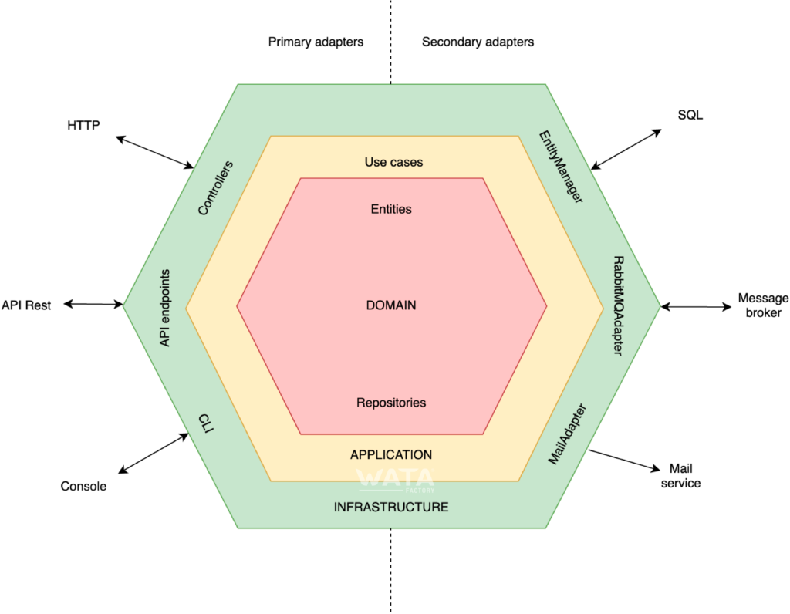

# API Exercise

We have an API proposal for make the management of users of a database. In order 
to do that we need to satisfy 3 possible scenarios:

### Requirements:
- Create new users: we need to receive as user data the next fields:
  ```
    - name --> mandatory
    - email_address --> mandatory, is unique
    - phone_number
    - date_of_birth
    - encrypted_password --> mandatory
    - address
  ```
- Update existing users: we receive the data of user to update identified by email 
- Delete users: user identified by email, and we need to deleted in a clear way
- All users must have all the data validated which means:
  ```
  - if have phone number is provide we need to verify that is a valid number
  - the user need to be older than 14 years
  - the password must be between 8 and 16 characters, must contain at least
  one capital letter, a number and a special character 
  ```

### The considerations for the exercises are:
- You can use the database service of docker-compose as a manual test,
but you need to do the automated tests 

- The database schema are not designed yet, so choose a design that fits with the requirements
and the data stored

- The application have to be well tested in order to cover all
edge cases and not only the happy path

- We need something simple but scalable

- Well constructed architecture, remember to separate each responsibility where it belongs.
You can use the next image as guide



### Run application
You can build and run the application with the Makefile provided, that have the commands
for build, run and test